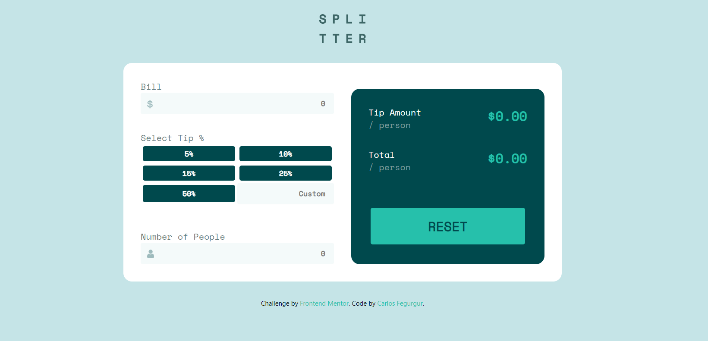

# Tip Calculator - Frontend Mentor Project

This is a solution to the [Tip calculator app challenge on Frontend Mentor](https://www.frontendmentor.io/challenges/tip-calculator-app-ugJNGbJUX).

## Table of contents

- [Overview](#overview)
  - [The challenge](#the-challenge)
  - [Screenshot](#screenshot)
  - [Links](#links)
- [My process](#my-process)
  - [Built with](#built-with)
- [Author](#author)

## Overview

### The challenge

Users should be able to:

- View the optimal layout for the app depending on their device's screen size
- See hover states for all interactive elements on the page
- Calculate the correct tip and total cost of the bill per person

### Screenshot

### Links

- Source Code: [Link](https://github.com/carlosaqf/tip-calculator)
- Live URL: [Link](https://carlosaqf.github.io/tip-calculator/)

## My process

### Built with

- Semantic HTML5 markup
- CSS custom properties
- Flexbox
- CSS Grid
- [React](https://reactjs.org/) - JS library
- [Styled Components](https://styled-components.com/) - For styles

## Author

- Website - [Carlos Fegurgur](https://cfegurgur.netlify.app)
- Frontend Mentor - [@carlosaqf](https://www.frontendmentor.io/profile/carlosaqf)
- LinkedIn - [Carlos Fegurgur](https://www.linkedin.com/in/cfegurgur/)
